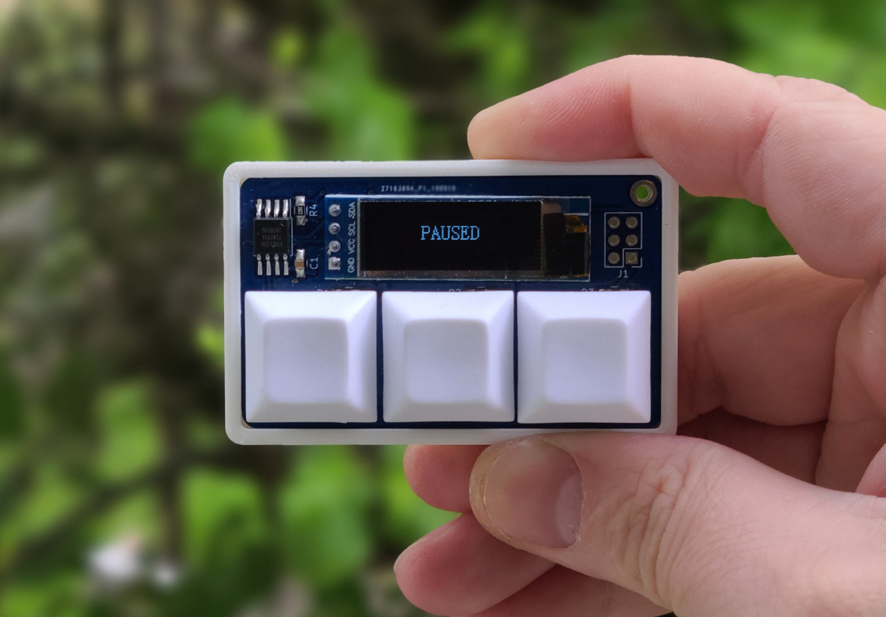

# The KeebCard, an open-source, low-power, mechanical switch computer keychain

This is the home of the KeebCard project. Originally designed as a business card, people loved it so much I decided to release a version of it as open-source (TODO: add a license).

The KeebCard is centered around an SSD1306-powered 128x32 monochromatic display and an ATTINY85-10SU. The code uses the wonderful [Tiny4kOLED library](https://github.com/datacute/Tiny4kOLED) to communicate with the screen via i2c. With 8 kilobytes of program space and 512 bytes of RAM, it's a fun challenge getting anything to run on this thing!

# Assembly

[Head here for the current assembly video](https://www.youtube.com/watch?v=mJQla--lSXY)

# Code

At the base of this project (currently) is the code that runs on the machine. I don't normally program in systems-level languages, so it's a little rough. You can change what program is flashed by messing with the define at the top of KeebCard.ino.

# Flashing

The KeebCard code is currently compiled and flashed with an ISP programmer via the Arduino suite. I'll add detailed flashing instructions later.

# Fabbing

If you want to make your own run of KeebCard boards, check out the GERBERS directory. These are gerbers produced by the standard settings in Kicad. They are confirmed to work with JLCPCB, but probably work just fine at a bunch of other board shops.

## BOM

All parts are available from Mouser save the screen

* 1x [SMTU2032-LF](https://www.mouser.com/ProductDetail/614-SMTU2032-LF)
* 1x [0805 0.1uF capacitor](https://www.mouser.com/ProductDetail/710-885012207016)
* 4x [0805 22kOhm resistors](https://www.mouser.com/ProductDetail/603-RC0805FR-0722KL)
* 2x [0805 4.7 kOhm resistors](https://www.mouser.com/ProductDetail/603-RC0805FR-074K7L)
* 1x [ATTINY85V-10SU](https://www.mouser.com/ProductDetail/556-ATTINY85V10SU)
* [Some headers](https://www.mouser.com/ProductDetail/538-22-28-4012)
* 1x [screen](https://www.aliexpress.com/item/32712441521.html?spm=a2g0s.9042311.0.0.296f4c4dcIoeUh)
* 3x [cherry MX](https://www.mouser.com/ProductDetail/CHERRY/MX1A-E1NW) or Kailh Choc switches and keycaps

# Modifying

If you want to modify the design, check out the KeebCard directory, which houses the original Kicad project.  
